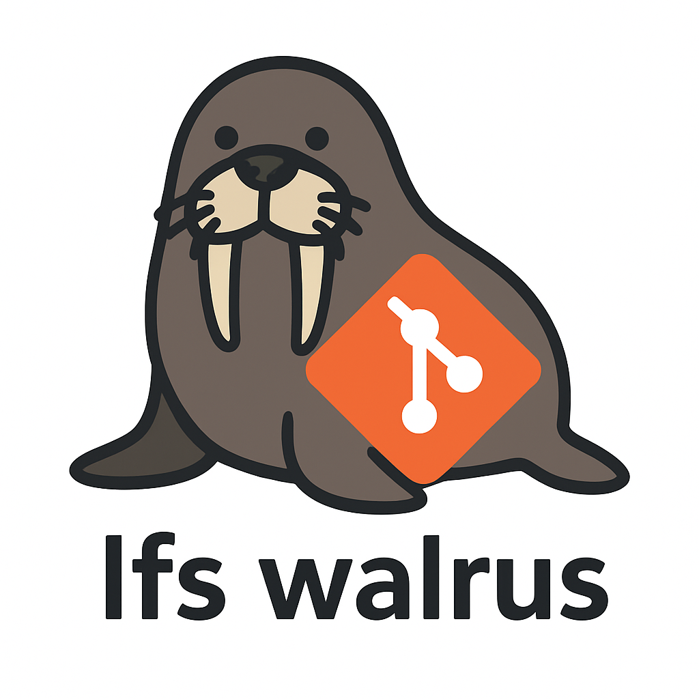

# git-lfs-walrus

<div align="center">
  
</div>

A [git-lfs](https://git-lfs.github.com/) custom transfer & extension that stores large files with Walrus decentralized storage.

*Based on the excellent [git-lfs-ipfs](https://github.com/sameer/git-lfs-ipfs) project by Sameer Puri.*

## Prerequisites

- [Walrus CLI](https://docs.wal.app/) installed and configured
- Git LFS installed (`git lfs install`)

## Installation

### Building

```bash
git clone <this-repository>
cd git-lfs-walrus/git-lfs-walrus-cli
cargo build --release
```

### Configuration

Set environment variables for easier configuration (adjust paths as needed):

```bash
# Set these in your shell profile (~/.bashrc, ~/.zshrc, etc.)
export GIT_LFS_WALRUS_CLI="${PWD}/target/release/git-lfs-walrus-cli"
export GIT_LFS_WALRUS_WRAPPER="${PWD}/clean_wrapper.sh" 
export WALRUS_CLI_PATH="/usr/local/bin/walrus"  # Or wherever walrus is installed
```

Add the custom transfer and extensions for Walrus to your `~/.gitconfig`:

```
[lfs]
	standalonetransferagent = walrus
[lfs "customtransfer.walrus"]
	path = git-lfs-walrus-cli
	args = --walrus-path ${WALRUS_CLI_PATH} transfer
	concurrent = true
	direction = both
[lfs "extension.walrus"]
    clean = ${GIT_LFS_WALRUS_WRAPPER} ${GIT_LFS_WALRUS_CLI} --walrus-path ${WALRUS_CLI_PATH} clean %f
    smudge = ${GIT_LFS_WALRUS_CLI} --walrus-path ${WALRUS_CLI_PATH} smudge %f
    priority = 0
```

Or use relative paths (assuming you're in the git-lfs-walrus directory):

```
[lfs]
	standalonetransferagent = walrus
[lfs "customtransfer.walrus"]
	path = ../target/release/git-lfs-walrus-cli
	args = --walrus-path walrus transfer
	concurrent = true
	direction = both
[lfs "extension.walrus"]
    clean = ../clean_wrapper.sh ../target/release/git-lfs-walrus-cli --walrus-path walrus clean %f
    smudge = ../target/release/git-lfs-walrus-cli --walrus-path walrus smudge %f
    priority = 0
```

## Usage

Use git LFS normally - all subsequent files added to LFS will be stored in Walrus.

```bash
git lfs track "*.bin"
git add large-file.bin
git commit -m "Add large file"
```

### Configuration Options

Set the default number of epochs for Walrus storage:

```bash
git config lfs.walrus.defaultepochs 25  # Defaults to 50 if not set
```

### Additional Commands (WIP)

Check if your LFS files stored in Walrus have expired:

```bash
git-lfs-walrus-cli walrus-check                      # Check all LFS files
git-lfs-walrus-cli walrus-check file1.bin file2.bin  # Check specific files
```

Refresh expired files in Walrus:

```bash
git-lfs-walrus-cli walrus-refresh                   # Refresh all expired files
git-lfs-walrus-cli walrus-refresh file1.bin         # Refresh specific files
```

## How it works

- **Clean**: Stores files in Walrus and creates LFS pointer files with Walrus blob IDs
- **Smudge**: Retrieves original files from Walrus using blob IDs from LFS pointers  
- **Transfer**: Handles upload/download operations for LFS custom transfers

Files are stored using Walrus's decentralized blob storage with erasure coding for reliability.

## Testing

### Prerequisites for Testing

1. **Install Walrus CLI**: Follow the [Walrus documentation](https://docs.wal.app/) to install and configure the Walrus client
2. **Configure Walrus**: Ensure you have a valid Walrus configuration file and can run basic commands:
   ```bash
   walrus --help
   walrus list-blobs  # Should work without errors
   ```

### Unit Tests

Run the unit tests (note that integration tests are ignored by default since they require Walrus):

```bash
cd git-lfs-walrus-cli
cargo test
```

To run tests that require Walrus to be installed and configured:

```bash
cargo test -- --ignored
```

### Integration Testing

An interactive test script is provided to demonstrate the functionality of the extension:

```bash
./integration_test.sh
```

#### Quick Integration Test

1. **Build the project**:
   ```bash
   cargo build --release
   ```

2. **Manual CLI testing**:
   ```bash
   # Test basic argument parsing
   ./target/release/git-lfs-walrus-cli --help
   
   # Test new commands
   ./target/release/git-lfs-walrus-cli walrus-check
   ./target/release/git-lfs-walrus-cli walrus-refresh
   ```

3. **Git LFS integration test** (using the provided test-repo):
   ```bash
   cd test-repo
   
   # Configure default epochs (optional)
   git config lfs.walrus.defaultepochs 25
   
   # Add files (triggers Walrus storage)
   git add .gitattributes large_file.txt
   
   # Check status
   git status
   
   # Test commands
   ../target/release/git-lfs-walrus-cli walrus-check
   ```

#### Verifying File Upload to Walrus

After successfully adding files with `git add`, you can verify the upload worked:

1. **Check the LFS pointer** (shows Walrus blob ID):
   ```bash
   git show HEAD:large_file.txt
   ```

2. **Test end-to-end retrieval** (best verification):
   ```bash
   # Backup original, delete, and retrieve from Walrus
   cp large_file.txt large_file.txt.backup
   rm large_file.txt
   git checkout large_file.txt
   
   # Compare original vs retrieved
   echo "=== Original ==="
   cat large_file.txt.backup
   echo "=== Retrieved from Walrus ==="
   cat large_file.txt
   ```

3. **Extract Walrus blob ID** (for direct Walrus commands):
   ```bash
   # The actual Walrus blob ID is in the comment line (if present)
   BLOB_ID=$(git show HEAD:large_file.txt | grep "# walrus-blob-id:" | cut -d':' -f2 | tr -d ' ')
   echo "Walrus Blob ID: $BLOB_ID"
   
   # Note: The ext-0-walrus field contains a SHA256 hash, not the Walrus blob ID
   # Check blob status in Walrus (when blob ID is available)
   if [ ! -z "$BLOB_ID" ]; then
     walrus blob-status --blob-id $BLOB_ID
   else
     echo "Walrus blob ID not found in LFS pointer"
   fi
   ```

**✅ Success indicator**: If `git checkout` successfully retrieves the original file content after deletion, your integration is working perfectly!

#### Full Manual Setup

If you want to create your own test repository:

```bash
# Create a test repository
mkdir my-test-repo && cd my-test-repo
git init
git lfs install

# Configure git-lfs-walrus (using relative paths from parent directory)
git config lfs.standalonetransferagent walrus
git config lfs.customtransfer.walrus.path "../target/release/git-lfs-walrus-cli"
git config lfs.customtransfer.walrus.args "--walrus-path walrus transfer"
git config lfs.customtransfer.walrus.concurrent true
git config lfs.customtransfer.walrus.direction both
git config lfs.extension.walrus.clean "../clean_wrapper.sh ../target/release/git-lfs-walrus-cli --walrus-path walrus clean %f"
git config lfs.extension.walrus.smudge "../target/release/git-lfs-walrus-cli --walrus-path walrus smudge %f"
git config lfs.extension.walrus.priority 0

# Track large files
echo "*.bin filter=lfs diff=lfs merge=lfs -text" > .gitattributes
echo "large file content" > large-file.bin

# Add and commit (this will use Walrus)
git add .gitattributes large-file.bin
git commit -m "Add large file stored in Walrus"

# Check the blob
BLOB_ID=$(git show HEAD:large-file.bin | grep "ext-0-walrus" | cut -d' ' -f2 | cut -d':' -f2)
echo "Walrus Blob ID: $BLOB_ID"
   
# Check blob status in Walrus (when blob ID format is supported)
walrus blob-status --blob-id $BLOB_ID
```

### Troubleshooting Tests

- **Walrus CLI not found**: Ensure `walrus` is in your PATH
- **Configuration errors**: Check your Walrus config file is valid
- **Network issues**: Walrus requires network access to storage nodes
- **Permission errors**: Ensure you have write access to the working directory

### Demo Repository

You can create a demo repository to test the integration:

```bash
git clone <this-repository>
cd git-lfs-walrus
cargo build --release

# Follow the integration testing steps above
```
